# How to Create PDF Forms with Open Office and Xataface

This tutorial describes how to create a PDF forms using Open Office, then have them automatically filled with database data inside a Xataface application.  This is useful if you have specially formatted forms that need to be generated with database content, such as pay stubs, appointment forms, receipts, etc..

##Requirements

1. Open Office.  (I'm using version 4.1.1, but you should be able to use older versions also).
2. An application built with Xataface 2.0 or higher.
3. The application should have the Xataface FDF module installed.

##Overview

The following is a fairly typical use-case for a database application in the context of a University.  I have an application that helps manage teaching assistant job postings, applications, and appointments.  After selecting a "winning" candidate, the administrator needs to generate the contract.  The university provides these contact forms as an Excel file.  Some departments use the excel file directly to fill in the data for each appointment, but this is a waste of resources, since all of the information required for the contract is already in the database.

###The Existing Application

The existing application is built with Xataface.  The relevant portion of the database that we need to generate a contract involves primarily three tables:

1. `appointments` - Stores the actual appointment information (start/end dates, etc...)
2. `contacts` - The contact that is being offered the contract.
3. `positions` - The specific teaching positions to be filled by the appointment.

The EER for this portion looks like:

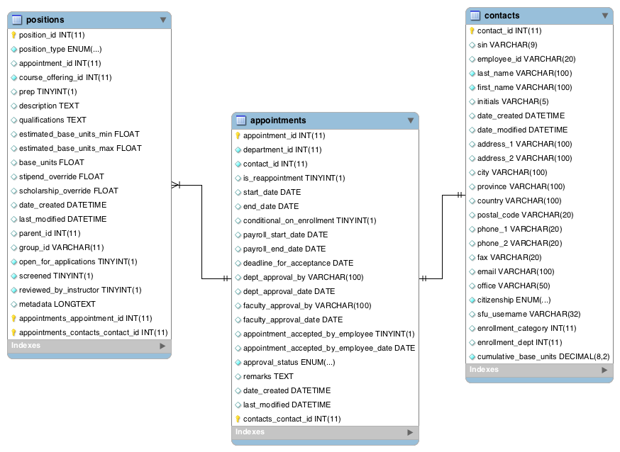

In addition, this application uses some features like grafted fields, and calculated fields to add make additional information available.  E.g. the `contacts` table has a `full_name` field defined as a calculated field via its delegate class, which is just a concatenation of the `first_name` and `last_name` fields.

###The Raw Form Template

We are going to start with the [Excel template](http://www.sfu.ca/content/dam/sfu/finance/Payroll/TSSU%20Appointment%20Form.xls) provided by [SFU Finance](http://www.sfu.ca/finance/forms.html).  

Opened in Excel, the form looks like 

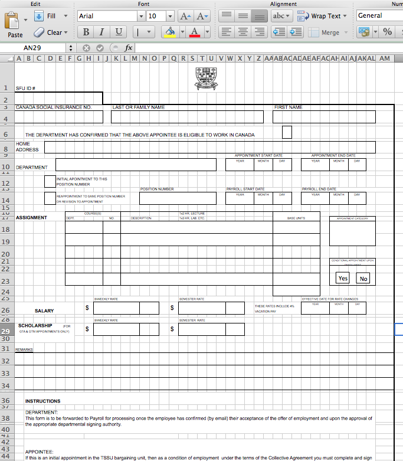

We're going to turn this into a PDF form using Open Office (since AFAIK Excel doesn't have functionality to create PDF forms).

###Adding Form Fields

In order to add form fields to the spreadsheet, we will open it in Open Office.  Once it is opened in Open Office, you should enable the "Form Controls" toolbar by selecting *View* > *Toolbars* > *Form Controls* from the top menu, to ensure that it is checked.

!(Open Office Form Controls Menu)[images/oo-form-controls-menu.png]

Once it is selected, you should see a floating toolbar like:

!(Form Controls Toolbar)(images/oo-form-controls-toolbar.png)

Make sure that design mode is on by pressing the "Design Mode on/off" toggle button .

**Adding the "Last Name" field**:

First click the mouse somewhere in the spreadsheet contents.  Then you should be able to select the "Text Field" button  in the Form controls toolbar.  Then click the mouse pointer in the top left corner of the "LAST OR FAMILY NAME" box, and drag to the bottom right corner to produce a rectangle that roughly covers the field as it is drawn on the spreadsheet.

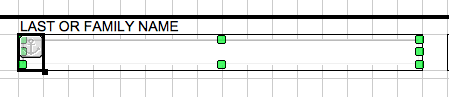

Now right-click (or control/click) on the field we just created, and select "Control..." from the contextual menu that should appear.

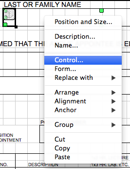

This should open up a "Properties" dialog as shown below:

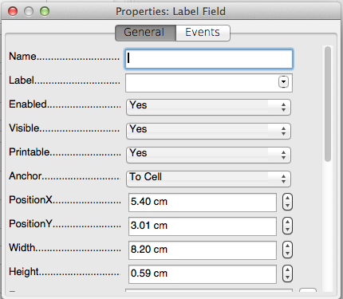

Enter "contact.last_name" into the "Name" field, and delete the existing content from the "Label" field so that it is blank.

> By naming the field `last_name`, it should be recognized as the `last_name` field of the context record (which will be a record from our appointments table).

###Testing Our Form

Before going any further, let's test out our form inside our application so that we can make sure that we are on the right track.

> Make sure you have [installed the FDF module](../README.md#installation-using-git) before proceeding to the next step.

1. Save the spreadsheet as an Open Document Spreadsheet.  Select *File* > "Save As...", and select ".ods" as the output format.  We'll name the file "TSSU_APPLICATION_FORM.ods":
  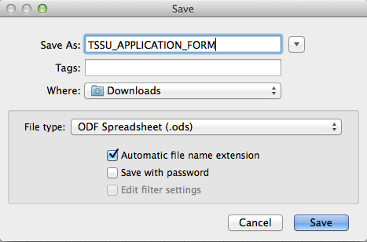
2. Select "File" > "Export as PDF" from the top menu:
  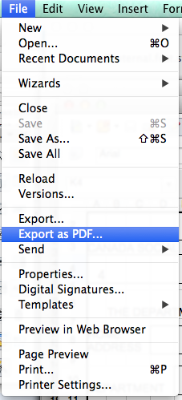
3. The first dialog that displays will allow you to select some options for the output PDF.  You should be able to leave these options as their default, but do a quick check to make sure that "Create PDF Form" is checked.  Then click "Export".
  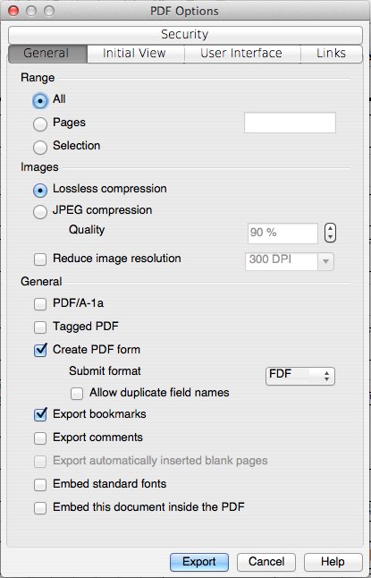
4. Next it will display a file dialog to select where to save the output.  We will call our file "TSSU_APPLICATION_FORM.pdf"  (i.e. the same name we gave our spreadsheet, but with the `pdf` extension.
5. Copy the *TSSU_APPLICATION_FORM.pdf* file into the Xataface application's `fdf_templates` directory (For more information on this folder, see the [Readme](../README.md).

At this point we should be able to test out our form.  The `fdf` module on its own merely provides a REST service to generate the PDF.  It doesn't integrate anything into the UI (we'll do that in the next step).  We can access this web service by crafting a URL to the application that specifies:

1. Which PDF template to use.  (Using the `--pdf-template` GET parameter)
2. Which record to use as a basis to fill the fields (Using normal Xataface URL conventions).
3. That we just want to generate a single PDF, and not a full set (Using the `--single` GET parameter.

For my case, I'm going to run my tests using the appointment with `appointment_id` = 883, so the URL I will use to generate the PDF is (split into multiple lines for readability):
~~~
http://example.com/path/to/myapp/index.php?
-action=fdf_report
&-table=appointments
&appointment_id==883
&--pdf-template=TSSU_APPLICATION_FORM.pdf
&--single=1
~~~

If everything went well, you should see the PDF form in the browser as shown below:

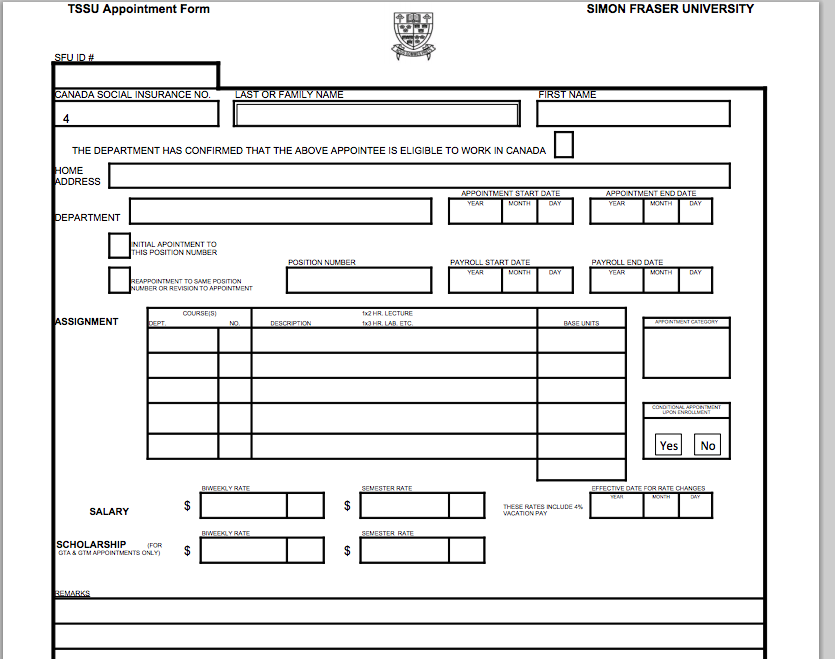

Notice that the "Last name" field shows up (we can see its 3D etched border), but it doesn't contain any content.  That's because the `appointments` table doesn't actually have a `last_name` field, so Xataface doesn't automatically fill it.

We have three choices to get Xataface to fill this field for us:

1. Create a grafted field in the Appointments table to load the contact's last name.
2. Create a calculated field in the Appointments table via its delegate class to show the last name of the contact in this appointment.
3. Implement the `fdf_fill_fields()` in the table's delegate class to manually create an associative array of data to display in our form.  

In this case, we're going to use option #2 (although in the *real* application, I chose option #3 because it provides the most flexibility).

**Implementing the `last_name` calculated field**:

> The next section assumes that you are familiar with Xataface delegate classes, and their use to implement calculated fields for a table in the database.  For more information of delegate classes see [this page](https://github.com/shannah/xataface/blob/master/docs/DelegateClasses.md#calculated-fields).

Inside the delegate class for the appointments table, we'll add the following method:

~~~
function field__last_name(Dataface_Record $record){
    return $record->val('contact.last_name');
}
~~~

> A quick explanation:  `Dataface_Record` supports a "dot" notation for accessing field values where you can access a related record's value using `relationship_name.fieldname`.  So in this case, because the `appointments` table has a relationship to the relationship's contact named `contact`, we can access the contact's last name via `contact.last_name`.

Now, for all intents and purposes, the `appointments` table has a `last_name` field.

Reloading the PDF again we can see that the "Last Name" field is indeed filled in:

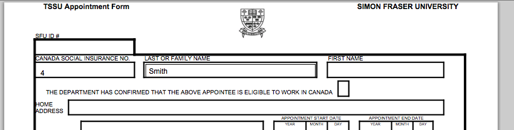

##Styling the Field

You may have noticed that the field has a 3D etched border that doesn't look quite right since the PDF is auto-generated and isn't meant to be filled in.  I personally find open office's form creation a little bit clumsy in this respect, but it is still possible to clean it up.  We can set the border style to "Flat", and the "Border Color" to white.  

> I couldn't find a way to set the border to none or the background to transparent - which would be ideal.  If you know how, please let [me](https://twitter.com/shannah78) know.

The "Control" dialog in Open office (the same one we used to set the field name), can be used to set all kinds of information about the field, including font, alignment, border, color, etc...

##Adding the Rest of the Fields

Adding the rest of the fields to the form is an exercise in repetition.  One tip, that might help this process is to use the `fdf_fill_fields` method of the delegate class to fill the fields instead of implementing each missing field as a calculated field.  Here is the full (finished) `fdf_fill_fields` method from my `appointments` delegate class for a sample.

~~~
    /**
     * A callback used by the fdf module.  It allows us to fill in a PDF form
     * @param Dataface_Record $rec The subject record.
     * @param array @$vals Associative array to be filled.
     * @param string $template_name The name of the PDF template we are working with.  This 
     * is located in the fdf_templates directory.
     */
    function fdf_fill_fields(Dataface_Record $rec, &$vals, $template_name){
        if ( $template_name == 'TSSU_APPLICATION_FORM.pdf' ){
            $contact = $rec->val('contact');
            if ( $contact ){
                $vals['first_name'] = $contact->display('first_name');
                $vals['last_name'] = $contact->display('last_name');
                $vals['sin'] = $contact->display('sin');
                $vals['student_number'] = $contact->display('employee_id');
                $vals['appointment_category'] = $contact->display('ta_type');
                
            }
            
            $vals['salary_biweekly_rate_dollars'] = intval($rec->val('stipend_biweekly')) ;
            $vals['salary_biweekly_rate_cents'] =  str_pad(''.floor(
                (floatval($rec->val('stipend_biweekly')) - floor($rec->val('stipend_biweekly'))
            )*100), 2, '0') ;
            
            $vals['salary_semester_rate_dollars'] = intval($rec->val('stipend_total')) ;
            $vals['salary_semester_rate_cents'] =  str_pad(''.floor(
                (floatval($rec->val('stipend_total')) - floor($rec->val('stipend_total'))
            )*100), 2, '0') ;
            
            $vals['scholarship_biweekly_rate_dollars'] = intval($rec->val('scholarship_biweekly')) ;
            $vals['scholarship_biweekly_rate_cents'] =  str_pad(''.floor(
                (floatval($rec->val('scholarship_biweekly')) - floor($rec->val('scholarship_biweekly'))
            )*100), 2, '0') ;
            
            $vals['scholarship_semester_rate_dollars'] = intval($rec->val('scholarship_total')) ;
            $vals['scholarship_semester_rate_cents'] =  str_pad(''.floor(
                (floatval($rec->val('scholarship_total')) - floor($rec->val('scholarship_total'))
            )*100), 2, '0') ;
            
            $vals['appointment_start_date_year'] = date('Y', strtotime($rec->strval('start_date')));
            $vals['appointment_start_date_month'] = date('m', strtotime($rec->strval('start_date')));
            $vals['appointment_start_date_day'] = date('d', strtotime($rec->strval('start_date')));
            
            $vals['appointment_end_date_month'] = date('m', strtotime($rec->strval('end_date')));
            $vals['appointment_end_date_year'] = date('Y', strtotime($rec->strval('end_date')));
            $vals['appointment_end_date_day'] = date('d', strtotime($rec->strval('end_date')));
            
            $vals['payroll_start_date_year'] = date('Y', strtotime($rec->strval('payroll_start_date')));
            $vals['payroll_start_date_month'] = date('m', strtotime($rec->strval('payroll_start_date')));
            $vals['payroll_start_date_day'] = date('d', strtotime($rec->strval('payroll_start_date')));
            
            $vals['payroll_end_date_month'] = date('m', strtotime($rec->strval('payroll_end_date')));
            $vals['payroll_end_date_year'] = date('Y', strtotime($rec->strval('payroll_end_date')));
            $vals['payroll_end_date_day'] = date('d', strtotime($rec->strval('payroll_end_date')));
            
            $vals['effective_date_year'] = $vals['payroll_start_date_year'];
            $vals['effective_date_month'] = $vals['payroll_start_date_month'];
            $vals['effective_date_day'] = $vals['payroll_start_date_day'];
            
            $vals['department'] = $rec->display('department.name');
            
            $aptType = $rec->val('appointment_type');
            
            
            $vals['initial_appointment'] = ($rec->val('is_reappointment'))? '' : 'X';
            $vals['reappointment'] = ($rec->val('is_reappointment'))? 'X' : '';
            
            $positions = $rec->getRelatedRecordObjects('positions');
            
            $idx = 1;
            foreach ($positions as $position) {
                $vals['courses_dept_'.$idx] = $position->display('department_code');
                $vals['courses_no_'.$idx] = $position->display('course_number');
                $vals['courses_description_'.$idx] = $position->display('contract_description');
                $vals['courses_base_units_'.$idx] = $position->display('base_units');
                $idx++;
            }
            $vals['courses_base_units_total'] = $rec->display('base_units_total');
            $vals['eligible_to_work_confirmed'] = $rec->val('eligible_to_work_confirmed') ? 'X' : '';
            $vals['conditional_upon_enrollment'] = $rec->val('conditional_on_enrollment') ? 'X' : '';
        }
~~~

**A couple of things to notice here:**

1. The call to `$rec->val('contact')` makes use of a calculated field that returns the full contact record related to this appointment.
2. We use the `$rec->getRelatedRecordObjects('positions')` call to obtain all of the related positions.  Then we use name mangling to add the position details to the form's flat namespace.  E.g. In the form, there is a table with rows for each course to be taught.  Since PDF forms don't support arrays (each field must have a unique name), we created separate fields in each row and used a naming convention like `courses_xxx_1` (for the first row) or `courses_xxx_2` for the second row, etc...

###The Final Form:

1. See the final .ODS spreadsheet (open this with Open Office): [TSSU_APPLICATION_FORM.ods](OpenOfficePDFFormTutorial_resources/TSSU_APPLICATION_FORM.ods)
2. See the final PDF form (open this with Open Office): [TSSU_APPLICATION_FORM.pdf](OpenOfficePDFFormTutorial_resources/TSSU_APPLICATION_FORM.pdf)
3. Screenshot:
 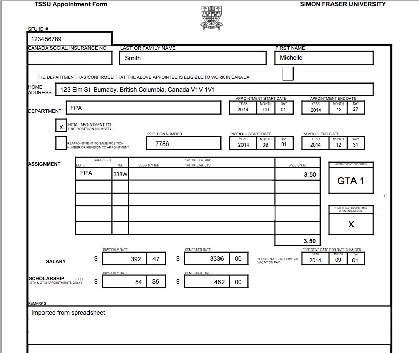
 
##Adding a "Print Contact" Button To the User Interface

Now that we are sure that we have our PDF form the way we like it, let's add a button to our user interface so that our users can generate the contract for a given appointment more easily.  We'll do this with a custom action definition in our [actions.ini file](https://github.com/shannah/xataface/blob/master/docs/Actions.md).

We add the following to our application's `actions.ini` file:

~~~
[print_appointment_form]
	category="record_actions"
	label="Print Contract"
	description="Print Teaching Assistant Appointment Form"
	condition="$record and $record->table()->tablename == 'appointments' and $record->val('appointment_type') < 5"
	    url="{$record->getURL('-action=fdf_report')}&--pdf-template=TSSU_APPLICATION_FORM.pdf&--single=1"
	url_condition="$record"
    icon="{$dataface_url}/images/print_icon.gif"
	target="_blank"
	order=100
~~~

**Some things to notice with this action**:

1. We use the `condition` directive to make sure it only shows up on the `appointments` table.
2. We use the `category` directive to specify that the action should be displayed with the record actions (i.e. along the top bar of the view tab when viewing the details of a record.
3. We use the `url` directive to craft the exact URL that will be used to generate the PDF.  The use of `$record->getURL()` in this generates the portion of the URL that selects the current record in the application.

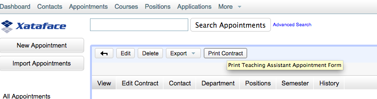

##What the Future Holds

I just finished the first release of the FDF module yesterday, so the feature set is still minimal - but it is enough to handle most typical use-cases.  In the future I may put some work into more automatic integration of form fields (so that you don't have to create as many calculated fields or implement a custom method to fill the fields).  I may also add a layer to make it easier for the end user to develop their own PDF forms.  

If you have feature requests, please just post them in the [Xataface Forum](http://www.xataface.com/forum).

##See Also

1. [Xataface](http://xataface.com) - A framework for developing data-driven applications with PHP and MySQL.
2. [Xataface FDF Module](https://github.com/shannah/xataface-fdf-module) - Module to add support for PDF forms in Xataface
3. [PDFTK](https://www.pdflabs.com/tools/pdftk-the-pdf-toolkit/) - Open source toolkit for manipulating PDFs.
4. [Open Office](https://www.openoffice.org/) - Open source office suite that allows you to create PDF forms from word, excel, and powerpoint documents.

