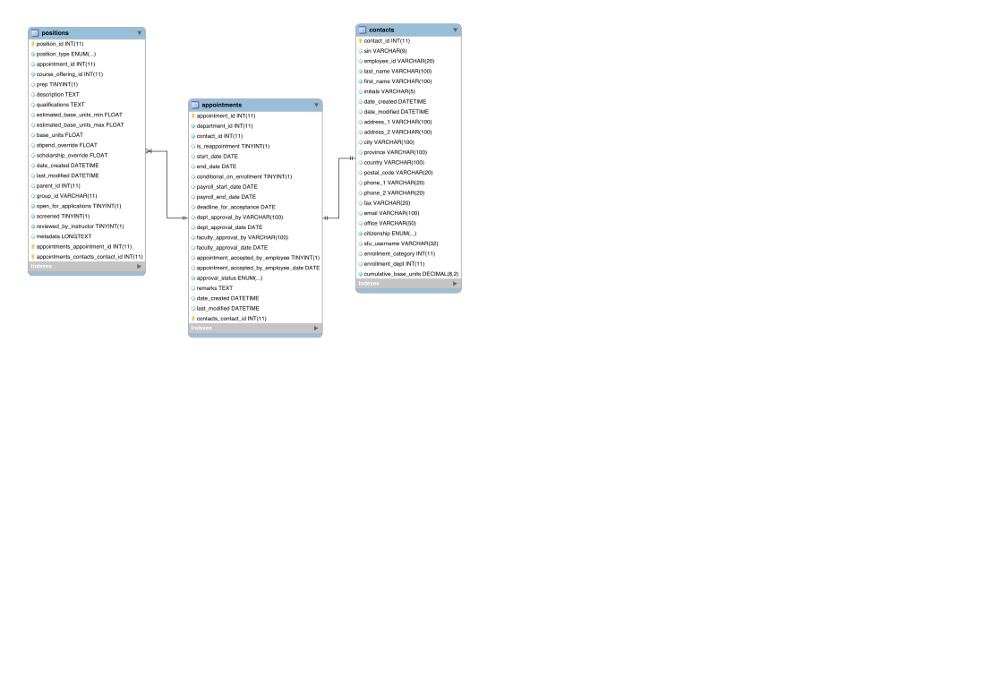

# How to Create PDF Forms with Open Office and Xataface

This tutorial describes how to create a PDF forms using Open Office, then have them automatically filled with database data inside a Xataface application.  This is useful if you have specially formatted forms that need to be generated with database content, such as pay stubs, appointment forms, receipts, etc..

##Requirements

1. Open Office.  (I'm using version 4.1.1, but you should be able to use older versions also).
2. An application built with Xataface 2.0 or higher.
3. The application should have the Xataface FDF module installed.

##Overview

The following is a fairly typical use-case for a database application in the context of a University.  I have an application that helps manage teaching assistant job postings, applications, and appointments.  After selecting a "winning" candidate, the administrator needs to generate the contract.  The university provides these contact forms as an Excel file.  Some departments use the excel file directly to fill in the data for each appointment, but this is a waste of resources, since all of the information required for the contract is already in the database.

###The Existing Application

The existing application is built with Xataface.  The relevant portion of the database that we need to generate a contract involves primarily three tables:

1. `appointments` - Stores the actual appointment information (start/end dates, etc...)
2. `contacts` - The contact that is being offered the contract.
3. `positions` - The specific teaching positions to be filled by the appointment.

The EER for this portion looks like:

